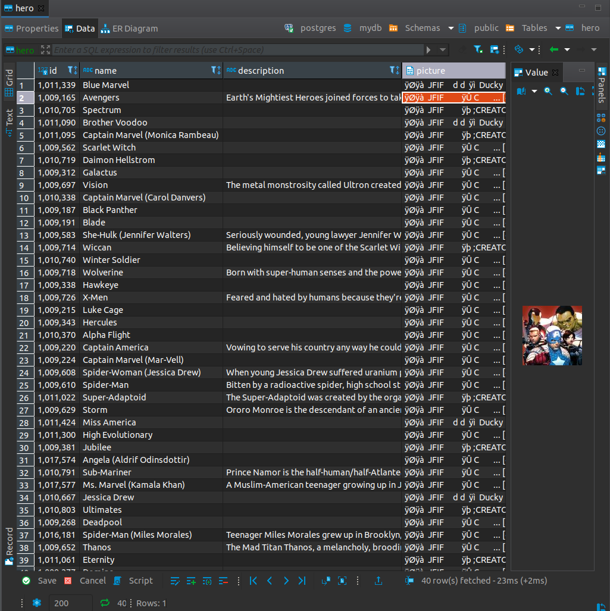

# Marvel: Spectrum and Associates

The purpose of this tool is to demonstrate working with an api. It first obtains the name, id, description, and picture of Spectrum, as well as the same information for all other characters she's worked with in other comics.

## Prerequisites

 - Obtain an api key from the [Marvel Developers Portal](https://developer.marvel.com/) 
 - Install [Docker](https://docs.docker.com/get-docker/)
 - Install [Postgres](https://www.postgresql.org/download/)
   - if using apt package management, you can just run `sudo apt install postgresql postgresql-contrib`
   - to connect, you need to enable remote connections (or add `--network host` to `docker run` which will remove network isolation and ship this)
     - locate your configuration file with `sudo -u postgres psql -c 'SHOW config_file'`
     - open config and ensure `listen_addresses = '*'`; `password_encryption = scram-sha-256` is also recommended
     - open the hba_file (referenced in the file locations section of your config file)
     - read examples and add a rule with the appropriate ip mask for your database server (for no security, use method trust). For example, `host all all 192.168.1.0/24 scram-sha-256`
 - Create a Postgres database and a db owner user with a password
    ```
    sudo -u postgres psql
    postgres=# create database mydb;
    postgres=# create user myuser with encrypted password 'mypass';
    postgres=# grant all privileges on database mydb to myuser;
    ```
 - Execute query in schema.sql to create the hero table
 - Create a file named `docker.env` to store your database and api secrets. Use the 
following format with the correct values
    ```
    PYTHONUNBUFFERED=1
    DB_HOST=xxx.xxx.xxx.xxx
    DB_DATABASE=mydb
    DB_USER=myuser
    DB_PASSWORD=mypassword
    MARVEL_PUBLIC_KEY=my-public-key
    MARVEL_PRIVATE_KEY=my-private-key
    DB_PORT=xxxx
    ```
   
## Build and Run

```
sudo docker build -t spectrum .
sudo docker run --env-file docker.env --rm spectrum
```

## Possible Improvements

 - **Paging results**: Spectrum is only in 32 comics. This is well within the max page size of 100 (but more than the default of 20). A generalized tool that pulls associates for any character would need to consider this. The most characters in a comic with Spectrum are 8, but this could need paging in a general purpose tool as well. Paging would be easy to implement with a recursive call that examines the returned values and then calls itself until the resultset is complete:
    ```python
    def fetch_comics(hero_id: int, **kwargs) -> List[Comic]:
        url = f'https://gateway.marvel.com/v1/public/characters/{hero_id}/comics'
        offset = kwargs.get('offset', 0)
        comics: List[Comic] = kwargs.get('comics', [])
        params = auth_params()
        params.update({
            'limit': PAGE_LIMIT,
            'offset': str(offset),
            'orderBy': 'title'
        })
        resp = requests.get(url, params)
        if not resp.ok:
            raise Exception(f'fetching comics for hero id {hero_id}: {resp.text}')
    
        data_object = resp.json()['data']
        new_comics: List[Comic] = [parse_comic(comic_object) for comic_object in data_object['results']]
        comics.extend(new_comics)
        retrieved_count = len(comics)
        total_comics = data_object['total']
    
        if retrieved_count < total_comics:
            return fetch_comics(hero_id,
                                offset=offset + PAGE_LIMIT,
                                comics=comics)
    
        return comics
    ```
 - **Cleaning up docker container**: The Docker image size can likely be reduced by carefully removing unneeded dependencies.
 - **Generators**: If converted into a generalized tool, it would be worth pulling all characters at once since those would fit inside 15 pages of size 100. This would probably mean changing functions that return a list of a type into functions that yield the objects as they are fetched and parsed.
 - **Testing**: The scope of this project is tiny and type annotations assist in accuracy, but a larger tool should use a project such as pytest for unit tests. 

## Results

### Output

```
# docker run --env-file docker.env --rm spectrum
found 40 characters:
Blue Marvel, Avengers, Spectrum, Brother Voodoo, Captain Marvel (Monica Rambeau), Scarlet Witch, Daimon Hellstrom, Galactus, Vision, Captain Marvel (Carol Danvers), Black Panther, Blade, She-Hulk (Jennifer Walters), Wiccan, Winter Soldier, Wolverine, Hawkeye, X-Men, Luke Cage, Hercules, Alpha Flight, Captain America, Captain Marvel (Mar-Vell), Spider-Woman (Jessica Drew), Spider-Man, Super-Adaptoid, Storm, Miss America, High Evolutionary, Jubilee, Angela (Aldrif Odinsdottir), Sub-Mariner, Ms. Marvel (Kamala Khan), Jessica Drew, Ultimates, Deadpool, Spider-Man (Miles Morales), Thanos, Eternity, Domino
complete
```

### Viewing

Many database tools, such as [DBeaver](https://dbeaver.io/), will show a preview of the images in a Postgres `bytea` field.



## Attribution

Data provided by Marvel. © 2021 MARVEL. All character names and IP of Marvel is used only to demonstrate talking to an api with requests and storing results via psycopg2 in Postgres. 
